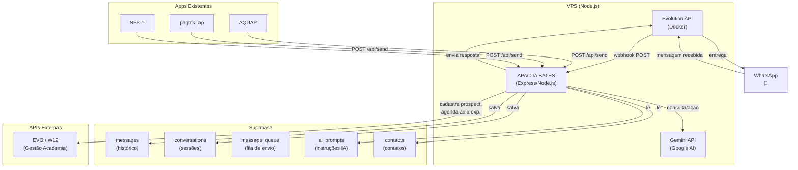

# APAC-IA SALES — Infraestrutura WhatsApp + Agente IA

Backend Node.js que centraliza a comunicação por WhatsApp da AP Academia, conectando os webapps existentes (AQUAP, pagtos_ap, NFS-e) a um agente de IA para atendimento, vendas e notificações.

## Contexto Atual

| Projeto | Stack | Função |
|---------|-------|--------|
| **AQUAP** | Next.js 16 + Supabase | Gestão de alunos, avaliações, presenças, certificados |
| **pagtos_ap** | Next.js 15 + Supabase + Tailwind | Folha de pagamento de colaboradores |
| **NFS-e** | Express + SOAP/XML | Emissão de NFS-e para prefeitura de SP |
| **EVO (W12)** | API REST externa | Sistema de gestão da academia (matrículas, vendas, prospects) |
| **WA Leads** | Extensão Chrome/WhatsApp Web | CRM de leads atual (Kanban) |

> [!IMPORTANT]
> ### Sobre o WA Leads
> O WA Leads é uma **extensão de navegador** que roda sobre o WhatsApp Web. Ele **não possui uma API REST pública documentada** para integração programática. Isso significa que **não serve** como camada de envio/recebimento de mensagens para este projeto.
>
> **Recomendação:** Usar a **Evolution API** (open-source, self-hosted) como provedor de WhatsApp. Ela é gratuita, roda na mesma VPS, oferece API REST completa para enviar/receber mensagens, suporta webhooks e é amplamente usada no Brasil com integrações de IA. O WA Leads pode continuar sendo usado para gestão visual de leads em paralelo, se desejado.

## Open Questions

> [!IMPORTANT]
> **1. Provedor de WhatsApp — confirma Evolution API?**
> Dado que o WA Leads não tem API programática, proponho usar a **Evolution API v2** (self-hosted, gratuita, Docker). Ela conecta via QR Code ao número de WhatsApp Business da academia e oferece endpoints REST para enviar/receber mensagens + webhooks. Você concorda ou prefere outro provedor (Z-API, API oficial da Meta)?

> [!IMPORTANT]
> **2. Chave de API do Gemini**
> Você mencionou que o WA Leads tem um campo para chave Gemini. Para este projeto, precisamos de uma **Google AI API Key** (Gemini). Você já tem uma? Se não, é gratuita para uso básico em [ai.google.dev](https://ai.google.dev).

> [!IMPORTANT]
> **3. Número de WhatsApp**
> Este sistema vai usar o **mesmo número** que já está no WA Leads, ou um **número separado** para o bot de vendas/atendimento?

> [!IMPORTANT]
> **4. Hosting da Evolution API**
> A Evolution API precisa de Docker. A VPS/Hostgator onde o AQUAP roda suporta Docker? Se não, podemos usar uma VPS separada barata (Oracle Free Tier, por exemplo).

## Arquitetura Proposta



### Fluxos Principais

#### 1. 📩 Mensagem Recebida (Inbound)
```
WhatsApp → Evolution API → Webhook POST → Backend
  → Identifica contato (Supabase contacts)
  → Verifica se tem consultor humano atribuído
  → Se sim: notifica consultor e registra
  → Se não / bot ativo: envia ao Gemini com prompt + contexto
  → Gemini responde → Backend envia via Evolution API → WhatsApp
```

#### 2. 📤 Mensagem Enviada pelos Apps (Outbound)
```
App (AQUAP/pagtos/NFS-e) → POST /api/send
  → Backend valida + enfileira
  → Envia via Evolution API → WhatsApp
  → Registra no histórico (Supabase)
```

#### 3. 🤖 Ações do Agente IA (Tools/Function Calling)
O agente Gemini terá acesso a "ferramentas" para executar ações reais:
- **`buscar_planos`** → Consulta EVO API para listar planos/preços
- **`buscar_horarios`** → Consulta EVO API para horários de aulas
- **`cadastrar_prospect`** → Cria prospect no EVO
- **`agendar_aula_experimental`** → Agenda aula experimental no EVO
- **`emitir_voucher`** → Gera voucher de desconto/cortesia
- **`transferir_para_humano`** → Pausa o bot e notifica consultor

## Proposed Changes

### Componente 1 — Setup do Projeto

#### [NEW] `package.json`
Projeto Node.js com Express, dependências para Google AI (Gemini), Supabase client e HTTP client.

#### [NEW] `.env.example`
Template com todas as variáveis de ambiente necessárias:
```
# Evolution API
EVOLUTION_API_URL=http://localhost:8080
EVOLUTION_API_KEY=sua-chave
EVOLUTION_INSTANCE=apacademia

# Google AI (Gemini)
GOOGLE_AI_API_KEY=sua-chave-gemini

# Supabase (mesmo do AQUAP)
SUPABASE_URL=https://jlgailnbzybbhotmcuwc.supabase.co
SUPABASE_SERVICE_ROLE_KEY=...

# EVO / W12 (sistema gestão academia)
EVO_API_DNS=APACADEMIA
EVO_API_TOKEN=...

# Servidor
PORT=3100
WEBHOOK_SECRET=...
```

---

### Componente 2 — Banco de Dados (Supabase Migrations)

#### [NEW] `supabase/migrations/001_whatsapp_schema.sql`
Tabelas principais:
- **`contacts`** — Contatos com número WhatsApp normalizado, vinculado ao id do EVO
- **`conversations`** — Sessões de conversa (ativa, pausada, encerrada)
- **`messages`** — Histórico completo de mensagens (inbound + outbound)
- **`message_queue`** — Fila de mensagens programadas pelos apps
- **`ai_prompts`** — Prompts configuráveis do agente IA (editáveis sem deploy)
- **`human_handoffs`** — Registro de transferências para consultores humanos

---

### Componente 3 — Servidor Express (Core)

#### [NEW] `src/server.js`
Express app com rotas, middleware de autenticação, CORS para os apps irmãos.

#### [NEW] `src/routes/webhook.js`
Recebe webhooks da Evolution API (`MESSAGES_UPSERT`), processa e roteia para o handler de IA ou consultor humano.

#### [NEW] `src/routes/api.js`
Endpoints REST para os apps irmãos:
- `POST /api/send` — Enviar mensagem para um contato
- `POST /api/send-bulk` — Envio em lote (comunicados)
- `GET /api/conversations/:phone` — Histórico de conversa
- `POST /api/handoff` — Transferir conversa para humano
- `GET /api/status` — Health check

#### [NEW] `src/routes/admin.js`
Endpoints para gerenciamento:
- `GET /admin/prompts` — Listar prompts do agente
- `PUT /admin/prompts/:id` — Atualizar prompt
- `GET /admin/conversations` — Listar conversas ativas
- `GET /admin/metrics` — Métricas de atendimento

---

### Componente 4 — Integração WhatsApp (Evolution API)

#### [NEW] `src/services/evolution.js`
Client para a Evolution API:
- `sendText(phone, text)` — Enviar texto
- `sendMedia(phone, mediaUrl, caption)` — Enviar imagem/PDF
- `sendButton(phone, text, buttons)` — Mensagem com botões
- `getQrCode()` — Obter QR code para conectar instância
- `getConnectionStatus()` — Status da conexão

---

### Componente 5 — Agente de IA (Gemini)

#### [NEW] `src/services/ai-agent.js`
Agente inteligente usando Google Gemini com function calling:
- Recebe mensagem + contexto da conversa
- Consulta o prompt ativo do banco
- Envia ao Gemini com as tools disponíveis
- Processa tool calls (EVO API, vouchers, etc.)
- Retorna resposta final

#### [NEW] `src/services/ai-tools.js`
Definição das ferramentas que o Gemini pode chamar:
- `buscar_planos` / `buscar_horarios` / `buscar_modalidades`
- `cadastrar_prospect` / `agendar_aula_experimental`
- `emitir_voucher` / `consultar_disponibilidade`
- `transferir_para_humano`

#### [NEW] `src/prompts/vendas.md`
Prompt base do agente consultor de vendas (será carregado no banco na primeira execução):
- Persona, tom de voz, regras de negócio
- Informações sobre a academia (modalidades, horários, diferenciais)
- Políticas de preço, descontos, aula experimental
- Fluxo de atendimento (quando transferir para humano)

---

### Componente 6 — Integração EVO / W12

#### [NEW] `src/services/evo-client.js`
Client para a API do EVO (mesma autenticação Basic Auth já usada no AQUAP):
- `getPlanos()` — Listar planos/serviços ativos
- `getHorarios(modalidade)` — Grade horária
- `getProspect(phone)` — Buscar prospect por telefone
- `createProspect(data)` — Cadastrar prospect
- `scheduleExperimentalClass(prospectId, activityId)` — Agendar aula experimental
- `getSales(memberId)` — Consultar vendas de um membro

---

### Componente 7 — Processamento de Fila

#### [NEW] `src/workers/queue-processor.js`
Worker que processa a fila de mensagens (`message_queue`):
- Poll a cada 5s ou usa Supabase Realtime
- Envia mensagens pendentes via Evolution API
- Atualiza status (sent/failed/delivered)
- Rate limiting para não ser bloqueado pelo WhatsApp

---

### Componente 8 — Docker Setup

#### [NEW] `docker-compose.yml`
Orquestra:
- Evolution API (imagem oficial)
- Redis (para cache de sessões)
- O próprio backend (Node.js)

#### [NEW] `Dockerfile`
Dockerfile do backend Node.js.

---

## Fases de Implementação

### Fase 1 — Fundação (esta iteração)
- [x] Pesquisa e planejamento
- [ ] Setup do projeto (package.json, .env, estrutura de pastas)
- [ ] Schema do banco de dados (Supabase)
- [ ] Servidor Express com rotas básicas
- [ ] Client da Evolution API
- [ ] Webhook receiver (receber mensagens)
- [ ] Envio de mensagens (texto simples)
- [ ] API REST para os apps (`POST /api/send`)

### Fase 2 — Agente IA
- [ ] Integração com Gemini (chat básico)
- [ ] Prompt do consultor de vendas
- [ ] Gerenciamento de contexto/sessão da conversa
- [ ] Function calling (tools do EVO)
- [ ] Lógica de handoff para humano

### Fase 3 — Ações no EVO
- [ ] Cadastro de prospect
- [ ] Agendamento de aula experimental
- [ ] Consulta de planos e horários
- [ ] Emissão de voucher

### Fase 4 — Produção
- [ ] Docker compose para deploy
- [ ] Painel admin (gerenciar prompts, ver conversas)
- [ ] Métricas e logs
- [ ] Integração com os apps irmãos

## Verification Plan

### Automated Tests
```bash
# Teste do servidor
npm test

# Teste de envio de mensagem (dev)
curl -X POST http://localhost:3100/api/send \
  -H "Content-Type: application/json" \
  -d '{"phone": "5511999999999", "message": "Teste de integração"}'
```

### Manual Verification
- Conectar Evolution API via QR Code → verificar status
- Enviar mensagem de teste → verificar recebimento no WhatsApp
- Enviar mensagem pelo WhatsApp → verificar webhook recebido
- Testar fluxo completo de atendimento IA
- Testar envio de comunicado via API de um app irmão
